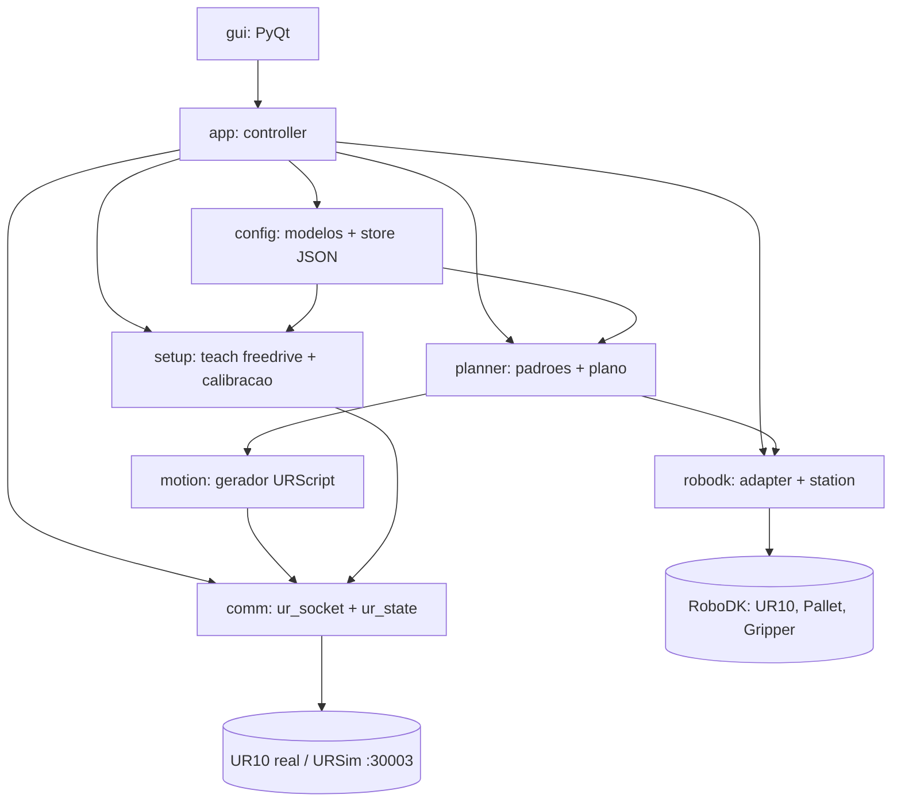
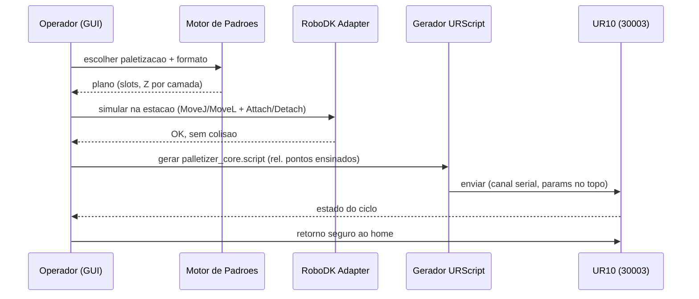

# Arquitetura Proposta — Software de Paletização UR10

> Documento de discussão para a equipe. Resume a arquitetura antes de começar a implementação.
> Baseado em: `docs/trabalho.md` (critérios), `robodk_sync/` (estação RoboDK real),
> `palletizing-UR10-project-Robotics-Rock-Roll/base.py` (comunicação TCP validada).
> Plano executável detalhado: `plans/palletizer-ur10-plan.md`.

---

## 1. Objetivo

Software em **Python** para o **operador** configurar e rodar paletizações no **UR10**, fácil
de adaptar a ambientes diferentes. Duas frentes de validação (conforme o trabalho):

- **Robô real (UR10):** cena mínima — pick + place em 4 posições + retorno seguro ao home.
- **Simulação (RoboDK):** padrões de amarração (Brick / Pinhole / Split Block) e ≥2 camadas.

Decisões já tomadas com o usuário:
- Interface: **GUI desktop (PyQt)**.
- Escopo: **software completo**, peso uniforme.
- Captura de pontos: **freedrive** no robô real.
- **A API do RoboDK é o motor de paletização** (gerar os formatos), não só visualização.

---

## 2. Decisão sobre o paletizador nativo do RoboDK

O add-in nativo (*Utilities ▸ Create Palletizing Project*) **não** será o núcleo:

| Aspecto | Add-in nativo | O que precisamos |
| --- | --- | --- |
| Configuração | Assistente GUI (arrastar caixas) | API Python dirigível pelo nosso app |
| Padrões | Layout custom por camada | Brick / Pinhole / Split Block **paramétricos** (exigência do trabalho) |
| Saída p/ robô | Post-processor (programa RoboDK) | URScript por socket na 30003 (já validado no `base.py`) |

**Uso previsto do add-in:** validação visual cruzada (montar uma cena e comparar com o que
nosso motor gera). **Questão aberta para a equipe:** vale investir nele como acelerador da
simulação, ou seguimos 100% com o motor próprio? (ver §9, OQ5)

---

## 3. Princípios de arquitetura

- **P1 — Fonte de verdade única.** Um *plano de paletização* ordenado (lista de slots: pose
  relativa ao pallet + camada + Z acumulado) alimenta **dois backends**: simulação RoboDK e
  URScript real. Os dois executam a mesma intenção; divergência = bug.
- **P2 — RoboDK como motor.** Padrões geram *targets relativos ao frame do pallet*, estendendo
  a linhagem do `box_calc` que já existe na estação (`RobotB_StoreParts.py`).
- **P3 — Comunicação = endurecer o `base.py`.** Não reinventar: corrigir os bugs conhecidos e
  transformar num módulo confiável.
- **P4 — Calibração central + Z dinâmico.** Velocidades/acelerações/blends num só lugar,
  emitidos no topo do `.script`; altura de aproximação sempre a partir do topo acumulado.
- **P5 — Reconciliação de frames explícita.** O plano é relativo ao pallet; converte-se para o
  `frame_pallet` do RoboDK (simulação) e para os pontos ensinados por freedrive (robô real).

---

## 4. Visão geral dos módulos

| Módulo | Responsabilidade |
| --- | --- |
| `config` | Modelos de dados + persistência JSON de várias paletizações nomeadas |
| `setup` | Captura de pontos por freedrive; parâmetros de calibração centralizados |
| `planner` | Motor de padrões (grid, Brick, Pinhole, Split Block) → plano de paletização |
| `robodk` | Adaptador que dirige a estação via `Robolink()` (simulação, colisão, alcance) |
| `comm` | Socket para 30003 (envio URScript) + leitura de pose (pacote realtime) |
| `motion` | Gera `palletizer_core.script` a partir do plano + pontos ensinados |
| `app` | Orquestração; máquina de estados do ciclo (canal serializado) |
| `gui` | Telas do operador: config, teach, escolher formato, simular, executar |

---

## 5. Fluxo de execução (config → padrão → robô)

---

## 6. Modelo de configuração (rascunho)

Cada paletização é um JSON nomeado em `configs/` com `schema_version`:

- **robô:** IP (`192.168.0.10`), porta (`30003`).
- **pontos ensinados:** pick, aproximação do pick, cantos do pallet, aproximação do pallet, home.
- **pallet:** contagens X/Y de caixas, nº de camadas, dimensões da caixa e do pallet (mm).
- **formato:** `grid` | `brick` | `pinhole` | `split_block`.
- **movimento (calibração):** `v_nominal`, `v_joint`, `a_nominal`, `blend_radius`, altura de aproximação.

Isso torna a troca de ambiente = trocar/editar um arquivo de config (objetivo do operador).

---

## 7. Comunicação com o robô (a partir do `base.py`)

Já **validado** no `base.py`: socket `192.168.0.10:30003`, envio de URScript
(`is_within_safety_limits` + `movej`/`movel`), e leitura de pose por parse do **pacote
realtime no offset `252:300`** (6 doubles) após `freedrive_mode()`.

**A endurecer (bugs conhecidos a corrigir):**
- **B1:** o `recv` está antes de enviar `get_actual_tcp_pose()`; abre socket novo por comando.
- **B2:** trata pose cartesiana `p[...]` como "juntas" — o modelo precisa separar `q` (juntas) de `p` (pose).
- **B3:** indentação quebrada no bloco `__main__` (rascunho).

**Movimentos (conforme o trabalho):** `movej` nas transições aéreas e home; `movel` obrigatório
em aproximação/descida/recuo; `blend_radius` nos trechos aéreos; **canal serializado** para nunca
enviar comandos sobrepostos ao robô (segurança).

---

## 8. Formatos de paletização e a estação existente

O motor estende o `box_calc` (`RobotB_StoreParts.py`), que já gera um **grid** de posições
relativas ao `frame_pallet`. Sobre ele implementamos as amarrações:

- **Grid:** base (sem amarração), referência.
- **Brick:** deslocamento de meia-caixa alternando entre camadas.
- **Pinhole:** arranjo com furo/centro, alternando por camada.
- **Split Block:** blocos girados 90° em camadas alternadas.

**Estação de referência (real):** dual-robot (`UR10 A/B`, `GripperA/B`, `PalletA/B`, esteira,
sensor). A **cena mínima real** mapeia para **um** robô fazendo pick→place em 4 posições; a
simulação estendida usa a estação completa. *(Questão aberta: reaproveitar a estação dual ou
criar uma single-robot dedicada — §9, OQ4.)*

---

## 9. Questões abertas para discutir com a equipe

- **OQ1 — Integração RoboDK:** app externo via `Robolink()` (proposto) **vs.** lógica como macros
  na estação sincronizados por `sync_robodk.py`? Muda a forma do adaptador.
- **OQ2 — Prazo:** demo física é **06-07/07**, hoje é **04/07**. O escopo completo cabe? A cena
  mínima pode ser um marco antecipado?
- **OQ3 — Versão do controlador UR** do lab (p/ casar URSim e confirmar o offset 252:300).
- **OQ4 — Estação:** reaproveitar a dual-robot+esteira ou criar uma single-robot para a cena mínima?
- **OQ5 — Add-in nativo:** usar só como validação visual, ou como acelerador da simulação?

---

## 10. Stack e riscos principais

**Stack:** Python 3, `robodk` (API), PyQt (GUI), socket TCP puro (URScript), pytest;
validação automatizada com **URSim** + estação RoboDK.

**Riscos de maior impacto:**
- Comando URScript sobreposto ao robô físico → movimento perigoso (mitigação: canal serializado).
- Reconciliação de frames RoboDK ↔ pontos ensinados incorreta (mitigação: conversão testada).
- Prazo da demo física apertado (mitigação: validar cena mínima em URSim antes do robô).
- Dependência de RoboDK aberto + Python embutido vs. venv do app.

---

## 11. Próximos passos

1. Discutir este documento com a equipe e fechar as OQs.
2. Rodar o spike de comunicação (endurecer `base.py` + drive externo do RoboDK).
3. Seguir as fases do plano `plans/palletizer-ur10-plan.md` (config → setup/planner → adapter →
   comm → GUI → integração → docs).
