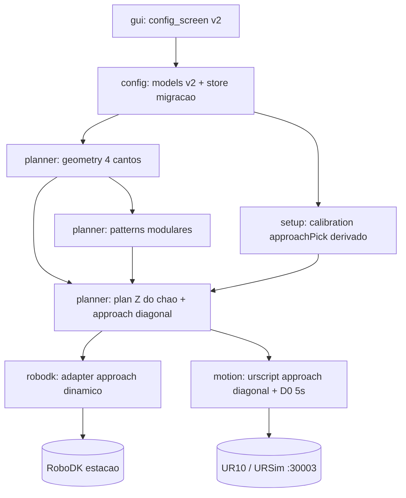

# Plano — Redesenho da Configuração da Paletização (entrada por 4 cantos + approach dinâmico + D0 5 s)

> Artefato durável. A execução lê este arquivo, encontra a primeira fase cujo aceite não é
> satisfeito e retoma. Base: pacote `palletizer/` já implementado (ver
> `plans/palletizer-ur10-plan.md`, Fases 3–8 concluídas). Este plano ALTERA o modelo de
> configuração e a lógica de aproximação/atuador; não recria o software.

## 1. Context & Analysis

Fatos verificados (lidos do repositório em 2026-07-04):

1. **Modelo atual** (`palletizer/config/models.py`): `PalletSpec` define o pallet por UM canto
   ensinado (`pallet_corner`) + `nx`/`ny` (contagens) + `length`/`width` físicos; `SCHEMA_VERSION = 1`.
   Pontos são um dict `{pick, pick_approach, pallet_corner, pallet_approach, home}`, cada um pose
   6DOF `[x,y,z,rx,ry,rz]` (m, rad).
2. **pick_approach é ponto ENSINADO** (`setup/calibration.py:DEFAULT_POINT_NAMES`), não derivado do
   pick + offset. `MotionParams.approach_height` (0.15 m) existe mas só governa a altura de place.
3. **Approach do pallet é ESTÁTICO**: `robodk/adapter.py:83` usa `target_pallet_safe` (um único
   ponto) para toda caixa; `motion/urscript.py:74-75,102` usa `p_pallet_app` (um único ponto
   ensinado `pallet_approach`) para toda caixa. Não há offset diagonal por caixa.
4. **Atuador**: `motion/urscript.py:77-81` — `set_digital_out(0, state); sleep(0.3)`. D0 correto,
   mas retenção de 0.3 s, não 5 s. O adapter RoboDK usa `AttachClosest`/`DetachAll` (simulação).
5. **Padrões**: `planner/patterns.py:_DISPATCH` tem 4 entradas (`grid`, `brick`, `pinhole`,
   `split_block`) com assinaturas heterogêneas (`grid` via lambda; os demais recebem `layer`).
6. **Z de place**: `planner/plan.py:60` usa `z_center = (layer + 0.5) * box.height` RELATIVO ao
   frame do pallet — a ancoragem ao Z absoluto do chão vem do ponto/canto ensinado, não somado
   explicitamente no plano.
7. **Persistência + GUI**: `config/store.py` faz save/load/list/delete JSON por nome, com
   `from_dict` rejeitando `schema_version` diferente. `gui/config_screen.py` expõe apenas nome,
   formato, nx/ny/camadas, dims da caixa e IP — não expõe cantos, pose de pick, offsets nem D0.
8. **Suíte atual**: `tests/` cobre store, patterns, plan, robodk_adapter, gui_smoke (38 testes
   verdes segundo `plans/palletizer-ur10-plan.md` §Outcomes).

Decisões do usuário (respostas de 2026-07-04):

9. **Entrada do pallet = 4 cantos**, coordenadas no CHÃO do pallet, suportando pallet **girado no
   plano**; a área útil e `nx`/`ny` são DERIVADAS pelo software a partir das dimensões da caixa. Ao
   calcular a pose de place, SOMAR a altura da caixa (os cantos são o piso do pallet).
10. **Padrões modularizados**: cada tipo de paletização é um módulo com o MESMO contrato de
    entrada, todos selecionáveis.
11. **Approach do pallet dinâmico**: offset diagonal pelo lado **oposto ao avanço do preenchimento**
    (o lado ainda vazio, para não atrapalhar as caixas já empilhadas), magnitude configurável em JSON.
12. **Orientação da caixa** = plano do pallet (nível, ferramenta apontando para baixo) + `rot_z`
    do padrão.
13. **Unidades da GUI = estilo PolyScope**: posição em **mm**, orientação como **vetor de rotação**
    `(Rx,Ry,Rz)` em **rad** (formato `get_actual_tcp_pose`); conversão mm→m na borda.

Suposições limitadas (assumptions):

- A1: Os 4 cantos são **aproximadamente coplanares e no mesmo nível** (piso do pallet); o frame é
  construído da origem `c0` + eixo X (`c0→c1`) + eixo Y (`c0→c3`), suportando rotação no plano; os
  4 cantos dão checagem de consistência (retangularidade/planaridade). Escopo: geometria do pallet;
  cantos fortemente não-coplanares ficam como OQ1 (interpolação de plano inclinado é futura).
- A2: A orientação-base da caixa é "ferramenta para baixo" (convenção `rotx(pi)` já usada em
  `robodk/adapter.py:37`) alinhada aos eixos do frame do pallet; o padrão adiciona `rot_z` (0/90).
  Escopo: montagem da pose.
- A3: A migração de configs v1→v2 é **best-effort**: campos preserváveis (caixa, movimento, IP,
  formato, home, pick) são mapeados; campos ausentes no v2 (ex.: cantos) recebem defaults e o
  operador reensina. Escopo: `store`/`models`.
- A4: `pick_approach` e `pallet_approach` deixam de ser pontos ensinados; se presentes em JSON v1
  são ignorados na migração. Escopo: `calibration`/pontos.

Escopo delimitado: modelo de configuração (`config/models.py`, `config/store.py`), geometria do
pallet (novo `planner/geometry.py`), modularização de padrões (`planner/patterns.py`), derivação de
approachPick e calibração (`setup/calibration.py`), plano (`planner/plan.py`), approach dinâmico e
D0 5 s (`robodk/adapter.py`, `motion/urscript.py`), GUI (`gui/config_screen.py`) e testes. Fora de
escopo: pallets não-nível/rotacionados (OQ1), captura por freedrive (já existente), comunicação TCP
(inalterada), e a validação em hardware físico (marco externo).

## 2. Design Decisions

- **DD1 — Modelo de entrada v2 centrado em geometria derivada.** `PalletSpec` passa a guardar
  `corners` = 4 cantos (`c0,c1,c2,c3`, cada `[x,y,z]` m, chão) + `layers`. `nx`/`ny`,
  `length`/`width` deixam de ser entrada e viram DERIVADOS por `planner/geometry.py`. Preserva o
  princípio "o algoritmo considera caixa E pallet para as poses".
- **DD2 — Frame do pallet e Z absoluto.** `geometry.py` constrói origem = `c0`, eixo X = versor de
  `c0→c1`, eixo Y = versor de `c0→c3`, extensões `L=|c0→c1|`, `W=|c0→c3|` (suporta pallet girado no
  plano); valida retangularidade/coplanaridade dos 4 cantos (checagem de consistência). O Z de place
  = `piso.z + (layer + 0.5) * box.height` (chão + altura acumulada; `piso.z` = média dos cantos —
  DD do trabalho: Z dinâmico, colisão ativa). A orientação-base é nível/ferramenta-para-baixo
  alinhada aos eixos do pallet + `rot_z` do padrão (decisões 9, 12).
- **DD3 — approachPick derivado.** `pick_approach` sai dos pontos ensinados; é calculado como
  `pick.pose + [0,0, approach_pick_offset_z, 0,0,0]` (offset vertical configurável em `MotionParams`).
  Um só ponto ensinado de pick; a aproximação é geométrica.
- **DD4 — Approach do pallet DINÂMICO, diagonal, pelo lado vazio.** Para cada slot, o approach = pose-
  alvo deslocada por um vetor diagonal NO FRAME DO PALLET apontando para o lado ainda VAZIO — o
  sentido oposto ao avanço do preenchimento (índices `i,j` crescentes, que ainda não foram
  colocados), com magnitude `pallet_approach_offset_xy`, mais elevação `pallet_approach_offset_z`;
  o vetor é transformado ao frame base pelos eixos X/Y do pallet (DD2). Assim a descida ocorre sobre
  células vazias e não varre caixas já empilhadas. Substitui o ponto estático único no adapter e no
  URScript. Configurável (decisão 11).
- **DD5 — Padrões como módulos de contrato uniforme.** Todo padrão implementa a mesma assinatura
  `f(box, grid, layer) -> List[(x,y,rot_z)]` e é registrado num dispatch; a GUI lista exatamente os
  padrões registrados como selecionáveis. `grid` permanece como base interna reutilizada pelos
  demais (decisão 10). Assinatura homogênea corrige a heterogeneidade atual (fato 5).
- **DD6 — Atuador D0 parametrizado.** Canal digital (default 0) e tempo de retenção (default 5.0 s)
  vão para `MotionParams` (`gripper_do`, `gripper_hold_s`); `urscript.gripper(True)` faz
  `set_digital_out(gripper_do, True); sleep(gripper_hold_s)` para prender nas ventosas (decisão do
  atuador). O adapter RoboDK mantém Attach/Detach (simulação).
- **DD7 — Migração de esquema explícita.** `SCHEMA_VERSION = 2`; `from_dict` migra v1→v2 (DD/A3) em
  vez de rejeitar, protegendo configs de operador; v2 é o formato canônico salvo.

### Temporal Flow (config v2 → geometria → dois backends)

```mermaid
sequenceDiagram
    participant Op as Operador (GUI)
    participant Cfg as Config v2 (JSON)
    participant Geo as Geometry (4 cantos)
    participant Pat as Padroes (modulos)
    participant Plan as Plano de Paletizacao
    participant DK as RoboDK Adapter
    participant UR as UR10 (30003)
    Op->>Cfg: caixa L/W/H, 4 cantos (mm), pick, offsets, D0
    Cfg->>Geo: 4 cantos + caixa
    Geo-->>Pat: frame (origem, eixos X/Y), grid derivado (nx, ny)
    Pat->>Plan: slots (x, y, rot_z) por camada
    Geo->>Plan: Z = chao + altura acumulada; approach do lado vazio por slot
    Plan->>DK: simular (approach diagonal, Attach/Detach)
    Plan->>UR: URScript (approachPick derivado, D0 5s, approach diagonal)
    UR-->>Op: ciclo / home seguro
```

## 3. Implementation Phases

### Fase 1 — Modelo de Config v2 + Migração de Esquema
- **Objective:** Reescrever `PalletSpec` para 4 cantos (`corners`) + camadas; adicionar offsets
  (`approach_pick_offset_z`, `pallet_approach_offset_xy`, `pallet_approach_offset_z`) e atuador
  (`gripper_do`, `gripper_hold_s`) em `MotionParams`; `SCHEMA_VERSION = 2` com migração v1→v2.
- **Executor Agent:** CoreImplementer-subagent
- **Wave:** 1
- **Dependencies:** nenhuma
- **Files:** `palletizer/config/models.py`, `palletizer/config/store.py`,
  `tests/test_config_store.py`, `configs/demo.json` (atualizar)
- **Tests:** `pytest tests/test_config_store.py`.
- **Acceptance Criteria:** (a) round-trip salva/recarrega config v2 idêntica; (b) `PalletSpec` expõe
  `corners` (4 cantos, cada lista de 3 floats) e `layers`, sem `nx/ny/length/width` como entrada;
  (c) `MotionParams` inclui os 3 offsets e `gripper_do`/`gripper_hold_s` com defaults (5.0 s, D0);
  (d) carregar um JSON `schema_version: 1` retorna uma config v2 válida via migração (não levanta
  ValueError), mapeando caixa/movimento/IP/formato/home/pick e aplicando defaults aos campos novos;
  (e) `configs/demo.json` reescrito em v2 e recarregável.
- **Quality Gates:** tests_pass, lint_clean, schema_valid.
- **Failure Expectations:** se a migração perder silenciosamente um campo preservável, bloquear; se
  v1 não puder migrar, registrar o motivo e falhar com mensagem clara (nunca corromper o arquivo).
- **Steps:** (1) Redefinir `PalletSpec` e estender `MotionParams`. (2) Bump `SCHEMA_VERSION=2`. (3)
  Implementar `from_dict` com ramo de migração v1→v2 (mapear preserváveis, defaults nos novos,
  ignorar `pick_approach`/`pallet_approach`). (4) Reescrever `configs/demo.json`. (5) Testes de
  round-trip v2 e de migração v1→v2.

### Fase 2 — Geometria do Pallet (4 cantos → frame + grid, Z do chão, approach do lado vazio)
- **Objective:** Novo módulo que constrói o frame do pallet dos 4 cantos (origem + eixos X/Y +
  checagem de consistência), deriva a área útil e `nx`/`ny` pela caixa, ancora o Z no chão + altura
  acumulada, e calcula o approach diagonal pelo lado ainda vazio (oposto ao avanço) por slot.
- **Executor Agent:** CoreImplementer-subagent
- **Wave:** 2
- **Dependencies:** Fase 1
- **Files:** `palletizer/planner/geometry.py` (criar), `tests/test_geometry.py` (criar)
- **Tests:** `pytest tests/test_geometry.py`.
- **Acceptance Criteria:** (a) dados 4 cantos e caixa, constrói frame (origem `c0`, eixo X `c0→c1`,
  eixo Y `c0→c3`) e retorna `nx = floor(L/box.length)`, `ny = floor(W/box.width)` — verificado
  inclusive com um pallet **girado no plano** (não alinhado aos eixos base); (b) valida
  retangularidade/coplanaridade dos 4 cantos dentro de uma tolerância e alerta/erra se violada;
  (c) `place_z(layer, box, floor_z)` = `floor_z + (layer + 0.5) * box.height` (≥2 camadas crescentes,
  `floor_z` = média dos cantos); (d) `empty_side_approach(i, j, nx, ny, offset_xy, offset_z, frame)`
  desloca o alvo no sentido de `i,j` crescentes (lado vazio), transforma pelos eixos do pallet e
  eleva em Z — verificável comparando dois slots em posições opostas do preenchimento; (e) caso do
  último slot (sem lado vazio adiante) tratado de forma determinística (waypoint acima, sem erro).
- **Quality Gates:** tests_pass, lint_clean.
- **Failure Expectations:** se `nx` ou `ny` derivarem 0 (caixa maior que o pallet), levantar erro
  explícito de configuração — não gerar plano vazio silencioso; cantos não-retangulares além da
  tolerância = bloquear com mensagem clara.
- **Steps:** (1) Frame (origem/eixos/extensões) a partir dos 4 cantos + validação de consistência.
  (2) Derivação de nx/ny com guarda de caixa-maior-que-pallet. (3) `place_z` ancorado no chão. (4)
  `empty_side_approach` (sentido oposto ao avanço, transformado pelos eixos do pallet). (5) Testes
  numéricos: pallet alinhado e girado, Z por camada, approach de slots opostos, último slot.

### Fase 3 — Modularização dos Padrões (contrato uniforme, 3 selecionáveis)
- **Objective:** Uniformizar a assinatura dos padrões para `f(box, grid, layer)`, registrar num
  dispatch e expor a lista de padrões selecionáveis; `grid` permanece base interna reutilizável.
- **Executor Agent:** CoreImplementer-subagent
- **Wave:** 3
- **Dependencies:** Fase 1, Fase 2
- **Files:** `palletizer/planner/patterns.py`, `palletizer/config/models.py` (enum, se preciso),
  `tests/test_patterns.py`
- **Tests:** `pytest tests/test_patterns.py`.
- **Acceptance Criteria:** (a) cada padrão selecionável implementa a MESMA assinatura e consome o
  mesmo objeto de grid derivado (Fase 2); (b) existe uma função pública que lista os padrões
  selecionáveis, consumida pela GUI; (c) Brick, Pinhole e Split Block produzem, para o mesmo grid,
  arranjos por camada distintos e verificáveis; (d) nenhum footprint se sobrepõe dentro de uma
  camada (reusar `footprints_overlap`); (e) contagem de caixas por camada = `nx*ny` (menos o furo no
  Pinhole).
- **Quality Gates:** tests_pass, lint_clean.
- **Failure Expectations:** padrões com assinaturas divergentes ou indistinguíveis entre camadas
  quebram o requisito de modularidade/amarração — bloquear.
- **Steps:** (1) Definir o contrato `f(box, grid, layer)` e adaptar os 4 existentes a ele. (2)
  Registrar dispatch + função `selectable_patterns()`. (3) Garantir grid derivado como entrada única.
  (4) Testes de uniformidade de assinatura, distinção por camada e não-sobreposição.

### Fase 4 — approachPick Derivado + Calibração Central
- **Objective:** Remover `pick_approach`/`pallet_approach` dos pontos ensinados; derivar approachPick
  de `pick + offset vertical`; manter só `{home, pick, pallet_corner?→cantos}` conforme v2.
- **Executor Agent:** CoreImplementer-subagent
- **Wave:** 3
- **Dependencies:** Fase 1
- **Files:** `palletizer/setup/calibration.py`, `tests/test_config_store.py` (estender ou novo
  `tests/test_calibration.py`)
- **Tests:** `pytest tests/test_calibration.py` (ou o alvo estendido).
- **Acceptance Criteria:** (a) `DEFAULT_POINT_NAMES` não inclui mais `pick_approach` nem
  `pallet_approach`; (b) existe função que devolve a pose de approachPick a partir de `pick` +
  `approach_pick_offset_z` (verificada numericamente); (c) `ensure_default_points` garante `home` e
  `pick`; (d) configs migradas de v1 que traziam `pick_approach` não quebram (ignorado, DD/A4).
- **Quality Gates:** tests_pass, lint_clean, safety_clear.
- **Failure Expectations:** se algum consumidor ainda exigir `pick_approach` ensinado (KeyError),
  bloquear até derivar geometricamente.
- **Steps:** (1) Enxugar `DEFAULT_POINT_NAMES`. (2) Função `pick_approach_pose(config)`. (3) Ajustar
  `ensure_default_points`. (4) Testes de derivação e de compat com migração.

### Fase 5 — Approach Dinâmico + D0 5 s (Adapter RoboDK e URScript)
- **Objective:** Substituir o approach estático por approach diagonal por caixa (Fase 2) no adapter e
  no gerador de URScript; usar approachPick derivado (Fase 4); atuador D0 com retenção configurável.
- **Executor Agent:** CoreImplementer-subagent
- **Wave:** 4
- **Dependencies:** Fase 2, Fase 3, Fase 4
- **Files:** `palletizer/planner/plan.py`, `palletizer/robodk/adapter.py`,
  `palletizer/motion/urscript.py`, `tests/test_plan.py`, `tests/test_robodk_adapter.py`,
  `tests/test_urscript.py` (criar/estender)
- **Tests:** `pytest tests/test_plan.py tests/test_robodk_adapter.py tests/test_urscript.py`.
- **Acceptance Criteria:** (a) o URScript gerado contém `set_digital_out(<gripper_do>, True)` seguido
  de `sleep(5.0)` (ou o `gripper_hold_s` configurado) e o place derivado do chão + altura; (b) o
  approach de pallet no URScript e no adapter é calculado por caixa via offset diagonal pelo lado
  vazio (oposto ao avanço do preenchimento; não um ponto único) — verificável comparando o approach
  de dois slots em posições opostas do preenchimento; (c) o
  approachPick usado é o derivado, não um ponto ensinado; (d) mantém `movej` em transição/home e
  `movel` em aproximação/descida/recuo e `is_within_safety_limits` antes do place; (e) o plano
  (`plan.py`) expõe o Z absoluto ancorado no chão e o approach diagonal por slot.
- **Quality Gates:** tests_pass, lint_clean, safety_clear.
- **Failure Expectations:** approach que aponte para o lado JÁ PREENCHIDO (colisão com caixas
  empilhadas) ou D0 preso além do necessário sem sleep correspondente = bloquear; divergência entre
  approach do adapter e do URScript quebra DD1 (fonte única) — bloquear.
- **Steps:** (1) `plan.py`: usar `geometry` para Z absoluto e approach do lado vazio por slot. (2)
  `adapter.py`: trocar `target_pallet_safe` estático pelo approach diagonal por caixa. (3)
  `urscript.py`: gerar approach diagonal por caixa, approachPick derivado e `gripper` com
  `gripper_do`/`gripper_hold_s` (5 s). (4) Testes de conteúdo do script, de approach por slot e de
  paridade adapter↔URScript.

### Fase 6 — GUI: Campos v2 + Carregar/Editar (estilo PolyScope)
- **Objective:** Expor na tela de config todos os campos v2 (caixa L/W/H, 4 cantos, pose de pick,
  offsets, D0/tempo, seleção de padrão a partir de `selectable_patterns()`) no estilo PolyScope
  (posição em mm, orientação como vetor de rotação em rad), carregando do JSON e permitindo edição/
  salvamento com conversão mm→m na borda.
- **Executor Agent:** UIImplementer-subagent
- **Wave:** 5
- **Dependencies:** Fase 1, Fase 3, Fase 4
- **Files:** `palletizer/gui/config_screen.py`, `tests/test_gui_smoke.py`
- **Tests:** `pytest tests/test_gui_smoke.py` (headless/offscreen).
- **Acceptance Criteria:** (a) a tela exibe campos para caixa L/W/H (mm), os 4 cantos (x/y/z em mm
  cada), a pose de pick (x/y/z em mm; rx/ry/rz como vetor de rotação em rad), os offsets (approachPick,
  approach diagonal xy/z), D0 e tempo de retenção, e um seletor de padrão populado por
  `selectable_patterns()`; (b) `on_load` popula todos esses campos a partir de uma config v2,
  convertendo m→mm na exibição; (c) `on_save` persiste todos eles (mm→m) e recarrega idêntico dentro
  de tolerância numérica; (d) `nx/ny` NÃO são editáveis (derivados) — exibidos como leitura ou
  omitidos; (e) smoke test instancia a tela e exercita load/save mockados sem exceção.
- **Quality Gates:** tests_pass, lint_clean.
- **Failure Expectations:** lógica de geometria/negócio dentro da GUI (em vez de nos serviços) quebra
  DD1/DD5 — manter a GUI fina e reportar.
- **Steps:** (1) Adicionar widgets dos novos campos. (2) `on_load`/`current_config` cobrindo v2. (3)
  Seletor de padrão via `selectable_patterns()`. (4) Exibir nx/ny derivados como leitura. (5) Smoke
  test estendido.

### Fase 7 — Integração e Regressão End-to-End
- **Objective:** Rodar a suíte completa e gerar o `palletizer_core.script` end-to-end a partir de uma
  config v2, validando estruturalmente as três mudanças (Z do chão+altura, approach diagonal por
  caixa, D0 5 s) e ≥2 camadas.
- **Executor Agent:** PlatformEngineer-subagent
- **Wave:** 6
- **Dependencies:** Fase 5, Fase 6
- **Files:** `tests/test_integration_config_redesign.py` (criar),
  `scripts/palletizer_core.script` (gerado)
- **Tests:** `pytest` (suíte inteira) + o teste de integração.
- **Acceptance Criteria:** (a) toda a suíte passa (sem regressão dos testes pré-existentes que
  continuarem aplicáveis); (b) o teste de integração carrega uma config v2, constrói o plano de ≥2
  camadas e gera o `.script`; (c) o `.script` gerado contém `sleep(5.0)` após `set_digital_out`,
  approach diagonal distinto por caixa e Z de place derivado do chão + altura; (d) `python -m
  compileall palletizer` limpo.
- **Quality Gates:** tests_pass, lint_clean, safety_clear, human_approved_if_required.
- **Failure Expectations:** qualquer aceite de fase anterior que falhe na integração dispara REPLAN
  da fase de origem; não marcar concluído com a suíte vermelha.
- **Steps:** (1) Config v2 de exemplo. (2) Geração end-to-end do `.script`. (3) Asserts estruturais
  (D0 5 s, approach diagonal, Z do chão). (4) Suíte + compileall. (5) Aprovação para uso.

## 4. Inter-Phase Contracts

- **Fase 1 → 2,3,4,6:** as dataclasses v2 (`PalletSpec` 2-cantos, `MotionParams` com offsets+D0) são
  o esquema estável; validar por round-trip e migração antes de consumir.
- **Fase 2 → 3,5:** `geometry` é a fonte da grade derivada, do Z absoluto e do approach diagonal;
  Fases 3/5 não recomputam geometria — consomem `geometry`.
- **Fase 3 → 5,6:** o contrato uniforme dos padrões e `selectable_patterns()` são consumidos pelo
  plano/URScript e pela GUI; assinatura divergente quebra o contrato.
- **Fase 4 → 5:** approachPick é derivado; o URScript/adapter não podem exigir ponto ensinado.
- **Fases 5,6 → 7:** adapter, URScript e GUI usam exatamente os offsets/D0 do config v2; a integração
  verifica paridade (DD1).

## 5. Open Questions

- **OQ1 (RESOLVIDA — 4 cantos):** o pallet é definido por 4 cantos, suportando rotação no plano
  (decisão 9). Resíduo: cantos **fortemente não-coplanares** (pallet inclinado) não são interpolados;
  a Fase 2 valida coplanaridade dentro de tolerância e erra se violada — interpolação de plano
  inclinado fica como trabalho futuro. Confirmar que a cena mínima usa pallet nível.
- **OQ2 (RESOLVIDA — lado oposto ao avanço):** o approach diagonal vem do lado ainda vazio, no
  sentido oposto ao avanço do preenchimento (decisão 11), para não atrapalhar as caixas empilhadas.
  Resíduo: a ordem de preenchimento é a de `build_plan` (`i` depois `j`); se o padrão alterar a
  ordem, o "lado vazio" acompanha a ordem efetiva daquele padrão (validado na Fase 5).
- **OQ3 (RESOLVIDA — estilo PolyScope):** GUI em mm (posição) + vetor de rotação em rad (orientação),
  formato `get_actual_tcp_pose` (decisão 13); conversão mm→m na borda. Sem pendência.

## 6. Risks

| Risk | Impact | Likelihood | Mitigation |
| ---- | ------ | ---------- | ---------- |
| Migração v1→v2 perde/corrompe configs de operador salvas | HIGH | Medium | `SCHEMA_VERSION=2` + migração best-effort testada (Fase 1); nunca sobrescrever sem mapear preserváveis |
| Approach aponta para o lado já preenchido e colide com caixas empilhadas | HIGH | Medium | Direção pelo lado vazio (oposto ao avanço) transformada pelos eixos do pallet + `is_within_safety_limits`; validar em RoboDK/URSim antes do físico (Fase 7); safety_clear |
| D0 preso 5 s sem sleep correspondente deixa ventosa em estado errado | HIGH | Low | `gripper_hold_s` acoplado ao `sleep` no mesmo bloco (DD6); teste de conteúdo do `.script` (Fase 5) |
| `nx/ny` derivados zeram (caixa > pallet) e geram plano vazio | MEDIUM | Low | Guarda explícita de erro de config na Fase 2 |
| 4 cantos ensinados não formam retângulo coplanar (erro de teach) | MEDIUM | Medium | Validação de retangularidade/coplanaridade com tolerância na Fase 2; erro claro em vez de plano torto |
| Paridade adapter↔URScript quebrada pelo novo approach (DD1) | MEDIUM | Medium | Fonte única via `geometry`/`plan`; teste de paridade (Fase 5) |
| Testes pré-existentes assumem modelo v1 e falham | MEDIUM | High | Atualizar testes junto ao modelo (Fases 1,3,5); suíte verde é gate da Fase 7 |

## 7. Semantic Risk Review

| Category | Applicability | Impact | Evidence Source | Disposition |
| -------- | ------------- | ------ | --------------- | ----------- |
| data_volume | not_applicable | LOW | configs JSON pequenos; nº de caixas trivial (`config/store.py`) | not_applicable (volume desprezível) |
| performance | applicable | LOW | geometria/plano O(nx·ny·layers) triviais; geração de string (`planner/`, `motion/urscript.py`) | resolved (custo desprezível) |
| concurrency | applicable | MEDIUM | canal serializado já existe; D0 preso 5 s bloqueia o ciclo (`app/controller.py`, `motion/urscript.py`) | resolved (retenção dentro do ciclo serializado; DD6) |
| access_control | not_applicable | LOW | operador único em rede de lab; sem multiusuário no escopo | not_applicable (sem controle de acesso) |
| migration_rollback | applicable | HIGH | `SCHEMA_VERSION` v1→v2 muda o modelo de config salvo (`config/models.py`, `config/store.py`) | resolved via migração testada (Fase 1, DD7) |
| dependency | applicable | LOW | sem novas dependências; PyQt/robodk inalterados (`requirements`) | resolved (sem mudança de dependências) |
| operability | applicable | HIGH | approach diagonal + D0 5 s comandam o UR10 físico; direção errada = colisão (`robodk/adapter.py`, `motion/urscript.py`) | resolved via approach pelo lado vazio (DD4) + `is_within_safety_limits` + validação sim/URSim (Fase 7) + safety_clear |

## 8. Architecture Visualization

### DAG de módulos (mudanças)



### Ciclo de uma caixa (approachPick derivado → place → D0 5 s)

```mermaid
sequenceDiagram
    participant C as Controller
    participant G as Geometry
    participant M as URScript Gen
    participant R as UR10 (30003)
    C->>G: slot -> Z do chao + altura, approach diagonal
    G-->>C: pose place + approach por caixa
    C->>M: gerar movimentos (approachPick derivado)
    M->>R: movej approachPick; movel pick
    R->>R: set_digital_out(D0, True); sleep(5.0)
    M->>R: movej approach diagonal; movel place
    R->>R: is_within_safety_limits -> set_digital_out(D0, False)
    R-->>C: recuo diagonal; proxima caixa / home
```

## 9. Success Criteria

1. Config v2 salva/recarrega por round-trip e migra v1→v2 sem perda de preserváveis (Fase 1).
2. `geometry` constrói o frame dos 4 cantos (pallet girado inclusive), deriva nx/ny e ancora Z no
   chão + altura acumulada (Fase 2).
3. Brick/Pinhole/Split Block são módulos de contrato idêntico, todos selecionáveis e distintos por
   camada, sem sobreposição (Fase 3).
4. approachPick é derivado do pick + offset; `pick_approach`/`pallet_approach` não são mais ensinados
   (Fase 4).
5. URScript e adapter usam approach diagonal por caixa e D0 preso 5 s; paridade adapter↔URScript
   (Fase 5).
6. A GUI carrega o JSON v2, edita todos os campos e salva idêntico; nx/ny exibidos como derivados
   (Fase 6).
7. Suíte verde e `.script` end-to-end com Z do chão, approach diagonal e `sleep(5.0)` após D0 (Fase 7).

## 10. Handoff & Execution Notes

- **Artefato:** `plans/palletizer-config-redesign-plan.md` (este arquivo). A execução lê aqui; não
  inline no chat.
- **Rota de verificação (LARGE):** rodar `/controlflow-claude-code:controlflow-verify` fases 1–3
  antes de implementar.
- **Ordem por wave:** 1 → 2 → (3 ∥ 4) → 5 → 6 → 7.
- **Paralelismo:** apenas Wave 3 tem paralelas (Fase 3 `patterns.py` ∥ Fase 4 `calibration.py`),
  posse de escrita disjunta. Demais seriais.
- **max_parallel_agents:** 10 (default); execução inline no contexto principal.
- **Diretório de trabalho:** `palletizing-UR10-project-Robotics-Rock-Roll/`; rodar `pytest` a partir
  da raiz do pacote.
- **Gate de segurança:** nenhuma mudança que altere o URScript físico avança sem safety_clear;
  Fase 7 exige human_approved_if_required (aprovação para colocar no UR10 real) e validação prévia em
  RoboDK/URSim.
- **Nota:** confirmar OQ1 (pallet nível) e OQ2 (direção do approach) antes da demo física; se A1 cair,
  REPLAN da Fase 2.

## Progress

- Plano criado 2026-07-04 a partir de leitura do pacote `palletizer/` e de 4 decisões do usuário
  (4 cantos, padrões modulares, approach diagonal pelo lado vazio, plano+rot_z, GUI estilo PolyScope).
- 2026-07-04: Fases 1–7 executadas inline; suíte 67 verdes, `compileall` limpo (ver Outcomes).

## Discoveries

- O software já existe e está testado (38 testes verdes, `plans/palletizer-ur10-plan.md` §Outcomes);
  este trabalho é redesenho do modelo de configuração e da lógica de aproximação/atuador, não build.
- Hoje o approach do pallet é um ÚNICO ponto estático (`robodk/adapter.py:83`,
  `motion/urscript.py:102`) e o D0 é preso só 0.3 s (`motion/urscript.py:80`).
- `pick_approach` e `pallet_approach` são pontos ENSINADOS hoje (`setup/calibration.py`), a serem
  substituídos por derivação geométrica.

## Decision Log

- 2026-07-04: entrada do pallet = 4 cantos (chão), suporta pallet girado; nx/ny e área derivados da
  caixa (usuário; OQ1 resolvida).
- 2026-07-04: Z de place = chão dos cantos + altura acumulada por camada (usuário).
- 2026-07-04: padrões modularizados com contrato de entrada idêntico, todos selecionáveis (usuário).
- 2026-07-04: approach do pallet dinâmico, diagonal pelo lado OPOSTO ao avanço do preenchimento (lado
  vazio), magnitude configurável (usuário; OQ2 resolvida).
- 2026-07-04: orientação da caixa = plano nível + `rot_z` do padrão (usuário).
- 2026-07-04: atuador em D0 preso 5 s (parametrizável) para prender nas ventosas (usuário).
- 2026-07-04: GUI estilo PolyScope — mm (posição) + vetor de rotação rad (orientação) (usuário; OQ3
  resolvida).

## Outcomes

- 2026-07-04: Fases 1–7 implementadas inline. `models.py` v2 (4 cantos + offsets + D0) com
  migração v1→v2; novo `planner/geometry.py` (frame dos 4 cantos, nx/ny derivados, Z do chão,
  approach do lado vazio, `frame_to_ur_pose`); `patterns.py` com contrato uniforme
  `f(box, grid, layer)` + `selectable_patterns()` (Brick/Pinhole/Split Block); `calibration.py`
  com `pick_approach_pose` derivado e só home/pick ensinados; `plan.py` com approach dinâmico por
  caixa; `urscript.py` e `robodk/adapter.py` usando o approach diagonal do lado vazio e D0 mantido
  5 s; GUI `config_screen.py` estilo PolyScope (mm + vetor de rotação) com nx/ny derivados.
- Testes: **67 pytest verdes** (era 38), `compileall` limpo. Geração end-to-end validada via
  `python main.py --gen demo`: `p_pallet` dos 4 cantos, `p_pick_app` derivado, `set_digital_out(0)`
  + `sleep(5.0)`, e um `p_place_app` diagonal por caixa (offset +0.10 m para o lado vazio).
- Pendente de hardware: validação em RoboDK/URSim/UR10 real (aproximação diagonal e retenção de
  5 s no atuador físico) antes da demo; confirmar OQ1 (pallet nível) na cena real.
- 2026-07-04 (pós-teste com cantos reais): dois bugs corrigidos após IK error no PolyScope.
  (a) `frame_to_ur_pose` embutia tool-down no `p_pallet`, invertendo o empilhamento (caixas iam
  para BAIXO do chão) e divergindo do adapter (DD1). Agora `p_pallet` é o frame NATURAL (Z para
  cima) e a garra-para-baixo é aplicada por caixa via `tool_down_offset_rotvec` (`rotx(pi)*rotz`),
  espelhando o adapter/box_calc. (b) `home` da config demo estava `[0,0,0,0,0,0]` (origem da base,
  inalcançável) — ajustado para uma pose alcançável acima do pick. Regressões adicionadas
  (empilhamento sobe, `rotx(pi)` no offset); 69 testes verdes.

## Idempotence & Recovery

- Reexecução de fase é segura: store JSON e geração de `.script` são determinísticos e sobrescrevem
  por nome; nenhum passo move o robô real sem confirmação.
- Cold-start: ler este arquivo, achar a primeira fase cujo aceite não é satisfeito e retomar; a
  migração v1→v2 (Fase 1) e a geometria de 4 cantos (Fase 2) são pré-requisitos de todas as demais.
