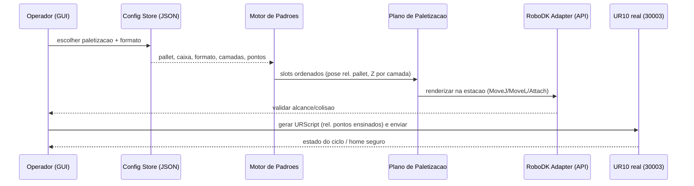
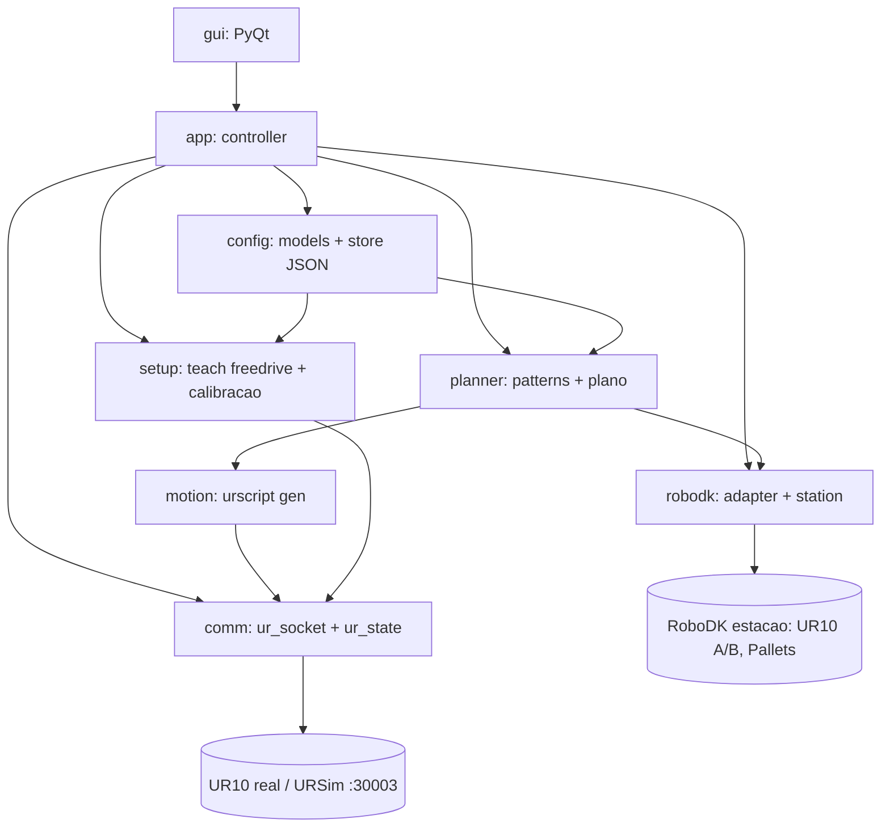
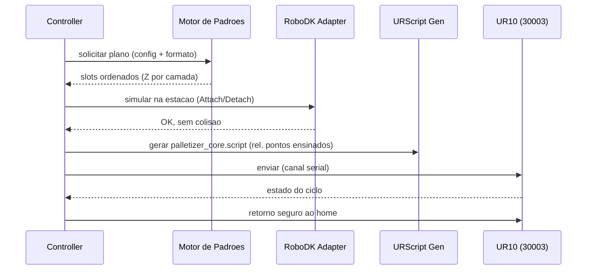

# Plano — Software de Paletização UR10 (RoboDK como motor + URScript)

> Artefato durável. Execução lê este arquivo, acha a próxima fase incompleta pelos critérios
> de aceite e continua. O documento de arquitetura (Fase 1) é o entregável a apresentar ao
> grupo. Refatorado após inspeção de `robodk_sync/` e `palletizing-UR10-project-Robotics-Rock-Roll/base.py`.

## 1. Context & Analysis

Fatos verificados (lidos do repositório):

1. Greenfield de código, mas com referências ricas: `palletizing-UR10-project-Robotics-Rock-Roll/`
   (repo git) contém `base.py` (comunicação TCP de referência) e `README.md`; o workspace
   externo tem `robodk_sync/` (estação RoboDK espelhada) e `docs/trabalho.md` (critérios).
2. **Estação RoboDK real (dual-robot):** `robodk_sync/programs/*` referenciam itens nomeados
   `UR10 A`, `UR10 B`, `GripperA`, `GripperB`, `PalletA`, `PalletB`, `ConveyorReference`,
   `MovingRef`, targets `PalletApproachA/B`, `ConvApproachA/B`, `Put/Get Conveyor`, sensor
   `Sensor SICK WL4S`. Params de estação: `SizeBox`, `SizePallet`, `ConvSpeed`.
3. **`RobotB_StoreParts.py` é a paletização de referência:** `box_calc(size_xyz, pallet_xyz)`
   gera um grid de posições — `pallet_x/y/z` são CONTAGENS de caixas por eixo, posição
   `(i+0.5)*size_x`; targets construídos com `robomath.transl(pos)*rotx(pi)` relativos ao
   `frame_pallet`; aproximação por `transl(0,0,-(APPROACH+SIZE_BOX_Z))`; grip simulado por
   `AttachClosest`/`DetachAll`; movimentos `MoveJ` (transição/aproximação) e `MoveL` (descida).
4. **`sync_robodk.py`** sincroniza macros Python (tipo 10) da estação com `programs/*.py` via
   `Robolink().setParam("Code")` / `AddFile`; requer RoboDK aberto e o Python embutido
   (`C:/RoboDK/Python-Embedded/python.exe`, que traz o pacote `robodk`).
5. **`base.py` — comunicação TCP validada:** socket para `192.168.0.10:30003`; envia URScript
   `if(is_within_safety_limits(p[...]): movej|movel(p[...], a, v)`; captura pose por
   `freedrive_mode()` → recv do pacote realtime → `struct.unpack('!dddddd', packet[252:300])`
   = pose TCP atual; comentário "Configurações de rede validadas".
6. `docs/trabalho.md` exige: cena mínima no UR10 real (pick + place em 4 posições + home
   seguro); simulação com padrões Brick/Pinhole/Split Block e ≥2 camadas completas; URScript
   nativo via socket; `movej` aéreo/home, `movel` em aproximação/descida/recuo; `blend_radius`;
   parametrização dinâmica; calibração centralizada; Z dinâmico (topo acumulado); `freedrive_mode()`;
   entregáveis `palletizer_core.script`, cena 3D, README, vídeo, GitHub.
7. Apresentação da cena mínima em 06/07 ou 07/07; hoje é 04/07/2026.

Bugs/limitações observados nas referências (a corrigir, não a copiar):

- B1: `base.py` faz `recv` do pacote ANTES de enviar `get_actual_tcp_pose()` (ordem
  invertida) e abre um socket novo por comando; a leitura de pose funciona por parsear o
  stream realtime de 30003 no offset 252:300, não pela resposta ao comando.
- B2: `base.py` chama o valor de `movej(p[...])` de "juntas" mas passa pose cartesiana (`p[]`);
  o modelo de movimento deve distinguir alvo em juntas (`q`) de alvo em pose (`p`).
- B3: `base.py` (bloco `__main__`) tem indentação quebrada e loop de paletização comentado —
  é rascunho de referência.

Decisões do usuário:

8. Interface GUI PyQt; escopo completo uniforme; captura de pontos por freedrive no robô real.
9. **A API do RoboDK deve ser o motor para diferentes formatos de paletização** (não apenas
   visualização) — reaproveitando a estação e a linhagem do `box_calc`.

Suposições limitadas (assumptions):

- A1: Código-fonte reside em `palletizing-UR10-project-Robotics-Rock-Roll/`; arquitetura e
  plano no workspace externo. Escopo: caminhos.
- A2: Persistência = JSON local em `configs/`, um arquivo por paletização, com `schema_version`.
- A3 (RESOLVIDA por fato 5): leitura de pose = parse do pacote realtime de 30003 no offset
  252:300; sem necessidade de RTDE.
- A4: A GUI/app externo dirige o RoboDK via `Robolink()` conectado à estação aberta (mesmo
  mecanismo dos macros), refatorando a lógica de `RobotB_StoreParts` para dentro do pacote.
  Escopo: modo de integração RoboDK; ver OQ1.
- A5: A cena mínima real mapeia para UM robô fazendo pick→place em 4 posições; a estação
  dual-robot+esteira é a referência de simulação estendida. Escopo: mapeamento cena↔estação.
- A6: Validação automatizada da comunicação usa URSim; o offset 252:300 é confirmado contra a
  versão do controlador do lab no início da Fase 2.

Escopo delimitado: desenho e implementação do software Python (config, setup, planner,
robodk adapter, comm, GUI), a simulação RoboDK (motor de padrões) e a preparação da cena
mínima no UR10 real. Fora de escopo: hardware da célula além do necessário à cena mínima,
autenticação multiusuário, e a edição do vídeo (entregável externo).

## 2. Design Decisions

- **DD1 — "Plano de paletização" como fonte de verdade única.** O motor de padrões produz uma
  lista ordenada de slots (pose relativa ao frame do pallet + índice de camada + Z acumulado).
  O adaptador RoboDK renderiza essa lista na estação via API; o gerador de URScript renderiza
  a MESMA lista relativa aos pontos ensinados (freedrive) para o robô real. Simulação e robô
  executam a mesma intenção; divergência = quebra de DD1.
- **DD2 — RoboDK API é o motor de paletização (diretriz do usuário).** Diferentes formatos
  (grid, Brick, Pinhole, Split Block) são gerados como targets relativos ao `frame_pallet`,
  estendendo a linhagem do `box_calc`; o adaptador reaproveita item names e o padrão
  `MoveJ`/`MoveL` + `AttachClosest`/`DetachAll` de `RobotB_StoreParts`.
- **DD3 — Comunicação = endurecimento do base.py.** Um único módulo de socket para
  192.168.0.10:30003, corrigindo B1/B2/B3: leitura de pose por parse contínuo do pacote
  realtime (offset 252:300), distinção `q` (juntas) vs `p` (pose), reuso de conexão, canal
  serializado (nunca URScript sobreposto).
- **DD4 — Calibração centralizada + Z dinâmico.** Todos os parâmetros (`v_nominal`, `v_joint`,
  `a_nominal`, blends, alturas de aproximação) num módulo único, emitidos no topo do `.script`;
  Z de place derivado do topo acumulado por camada (SIZE_BOX_Z), nunca estático.
- **DD5 — Reconciliação de frames.** O plano de paletização é pose-relativa-ao-pallet; para o
  RoboDK usa o `frame_pallet` da estação; para o robô real usa os pontos ensinados por
  freedrive como origem. Conversão explícita e testada (risco tratado na Fase 2/6/7).
- **DD6 — Paletizador nativo do RoboDK fora do núcleo.** O add-in *Create Palletizing Project*
  é assistente GUI (não dirigível pela API para um app externo), faz layout custom por camada
  (não os padrões nomeados Brick/Pinhole/Split Block exigidos) e emite via post-processor (não
  o URScript-por-socket validado). Portanto o motor de padrões é próprio (DD2); o add-in fica
  como ferramenta opcional de validação visual cruzada. Ver OQ5.

### Temporal Flow (config → padrão → dois backends)



## 3. Implementation Phases

### Fase 1 — Documento de Arquitetura Detalhada
- **Objective:** Produzir `docs/arquitetura.md` para apresentar ao grupo: módulos, modelos de
  dados, DD1–DD5, mapeamento com a estação RoboDK existente e o base.py, diagramas e riscos.
- **Executor Agent:** TechnicalWriter-subagent
- **Wave:** 1
- **Dependencies:** nenhuma
- **Files:** `docs/arquitetura.md` (criar)
- **Tests:** checagem automatável de estrutura (seções + blocos ```mermaid```) via grep/script.
- **Acceptance Criteria:** documento cobre visão geral, ≥7 módulos (config, setup, planner,
  robodk_adapter, comm, gui, app), modelos de dados, DD1–DD5, mapeamento explícito com os itens
  da estação (fato 2) e com o base.py (fato 5), ≥2 diagramas Mermaid válidos, tabela de riscos e
  stack; contagens verificáveis por script.
- **Quality Gates:** schema_valid, human_approved_if_required.
- **Failure Expectations:** se algum detalhe de protocolo/estação não puder ser afirmado sem
  validação, marcar como "a validar na Fase 2" em vez de inventar.
- **Steps:** (1) Consolidar fatos das seções 1–2. (2) Descrever módulos e interfaces, ancorando
  no box_calc e no base.py. (3) Especificar modelos de dados. (4) Documentar DD1–DD5 com
  diagramas. (5) Listar riscos e o que a Fase 2 resolve. (6) Rodar checagem e apresentar ao grupo.

### Fase 2 — Spike: Endurecimento da Comunicação + Drive Externo do RoboDK
- **Objective:** Transformar o base.py num protótipo confiável (corrige B1/B2/B3) e provar que
  o app externo dirige a estação via `Robolink()`.
- **Executor Agent:** Researcher-subagent
- **Wave:** 2
- **Dependencies:** Fase 1
- **Files:** `.../spikes/spike_socket.py`, `.../spikes/spike_pose_read.py`,
  `.../spikes/spike_robodk_drive.py`, `.../spikes/FINDINGS.md` (criar)
- **Tests:** spikes rodam contra URSim (socket + parse de pacote) e contra a estação RoboDK
  aberta (drive de um target); asserts sobre retornos.
- **Acceptance Criteria:** (a) URScript trivial aceito pelo URSim com conexão reutilizada;
  (b) pose lida e desserializada do offset 252:300 do pacote realtime, com a ordem correta
  (parse contínuo, não resposta a comando) — offset confirmado p/ a versão do controlador
  (OQ3); (c) `Robolink()` externo move um target na estação e lê a posição de volta;
  (d) `FINDINGS.md` registra portas, offset confirmado, versão do controlador e a decisão A4.
- **Quality Gates:** tests_pass, safety_clear.
- **Failure Expectations:** se o offset 252:300 divergir na versão do lab, registrar o offset
  correto e tratar como REPLAN da interface `comm`; parar antes da Fase 3 se nenhum parse funcionar.
- **Steps:** (1) Subir URSim + estação RoboDK de teste. (2) Reescrever o socket com reuso e
  ordem correta de leitura. (3) Validar parse de pose. (4) Provar drive externo do RoboDK.
  (5) Registrar `FINDINGS.md`.

### Fase 3 — Scaffolding + Modelo de Configuração e Persistência
- **Objective:** Estrutura do pacote, dependências, dataclasses de config e save/load/list/delete
  de paletizações nomeadas.
- **Executor Agent:** CoreImplementer-subagent
- **Wave:** 3
- **Dependencies:** Fase 2
- **Files:** `.../palletizer/__init__.py`, `.../palletizer/config/models.py`,
  `.../palletizer/config/store.py`, `.../requirements.txt`, `.../configs/` (dir),
  `.../tests/test_config_store.py` (criar)
- **Tests:** `pytest tests/test_config_store.py`.
- **Acceptance Criteria:** round-trip salva/recarrega config idêntica; list retorna ≥1; delete
  remove; `schema_version` presente/validado. Config modela: robô (IP/porta), pontos ensinados
  (pick, aproximações, cantos do pallet, home), pallet (contagens X/Y/camadas + SizeBox/SizePallet),
  formato de padrão, nº de camadas, params de movimento.
- **Quality Gates:** tests_pass, lint_clean, schema_valid.
- **Failure Expectations:** sem versionamento de esquema, configs antigas quebram — bloquear.
- **Steps:** (1) Pacote + `requirements.txt` (robodk, PyQt, pytest; nota sobre Python embutido do
  RoboDK vs venv externo). (2) Dataclasses. (3) Store JSON versionado. (4) Testes.

### Fase 4 — Setup/Teach (Freedrive) + Calibração Central
- **Objective:** Captura de pontos por freedrive (usando o parse validado da Fase 2) gravando no
  config; parâmetros de calibração centralizados.
- **Executor Agent:** CoreImplementer-subagent
- **Wave:** 4
- **Dependencies:** Fase 2, Fase 3
- **Files:** `.../palletizer/setup/teach.py`, `.../palletizer/setup/calibration.py`,
  `.../tests/test_teach.py` (criar)
- **Tests:** `pytest tests/test_teach.py` com `comm` mockada.
- **Acceptance Criteria:** capturar um ponto persiste pose nomeada no config; entrada/saída de
  freedrive emite os comandos corretos (mock); calibração expõe v_nominal/v_joint/a_nominal/blends;
  saída de freedrive garantida antes de qualquer movimento automático.
- **Quality Gates:** tests_pass, lint_clean, safety_clear.
- **Failure Expectations:** se freedrive puder ficar ativo durante movimento automático, bloquear.
- **Steps:** (1) Entrada/saída de freedrive via `comm`. (2) Captura de pose → ponto nomeado.
  (3) Calibração central. (4) Testes com mocks.

### Fase 5 — Motor de Padrões (Grid + Brick/Pinhole/Split Block) Multi-camadas
- **Objective:** Estender a linhagem do `box_calc` para gerar o plano de paletização ordenado
  (slots pose-rel-pallet + Z por camada) para grid e os três formatos de amarração, ≥2 camadas.
- **Executor Agent:** CoreImplementer-subagent
- **Wave:** 4
- **Dependencies:** Fase 3
- **Files:** `.../palletizer/planner/patterns.py`, `.../palletizer/planner/plan.py`,
  `.../tests/test_patterns.py`, `.../tests/test_plan.py` (criar)
- **Tests:** `pytest tests/test_patterns.py tests/test_plan.py`.
- **Acceptance Criteria:** para pallet+caixa dados, cada formato gera a contagem esperada de
  caixas por camada; ≥2 camadas com Z crescente (topo acumulado); Brick/Pinhole/Split Block
  alternam orientação/offset entre camadas de forma distinta e verificável; nenhum footprint se
  sobrepõe dentro de uma camada.
- **Quality Gates:** tests_pass, lint_clean.
- **Failure Expectations:** Z não crescente ou padrões indistinguíveis quebram o requisito de
  amarração — bloquear.
- **Steps:** (1) Refatorar box_calc para grid parametrizado. (2) Implementar Brick, Pinhole,
  Split Block com regra de alternância por camada. (3) Emitir plano ordenado com Z acumulado.
  (4) Testes por formato e por camada.

### Fase 6 — Adaptador RoboDK (motor de simulação via API)
- **Objective:** Conectar via `Robolink()`, dirigir a estação existente a partir do plano de
  paletização (MoveJ/MoveL/Attach/Detach) reaproveitando os item names, e validar alcance/colisão.
- **Executor Agent:** CoreImplementer-subagent
- **Wave:** 5
- **Dependencies:** Fase 2, Fase 5
- **Files:** `.../palletizer/robodk/adapter.py`, `.../palletizer/robodk/station.py` (item names),
  `.../tests/test_robodk_adapter.py` (criar)
- **Tests:** `pytest tests/test_robodk_adapter.py` contra estação RoboDK de teste (ou Robolink
  mock quando RoboDK ausente); contagem de caixas colocadas.
- **Acceptance Criteria:** o adaptador executa o plano na estação, colocando a contagem esperada
  de caixas em ≥2 camadas, usando `frame_pallet`, `transl/rotx` e `Attach/Detach` como em
  `RobotB_StoreParts`; aproximações via MoveJ, descidas via MoveL; nenhuma colisão reportada.
- **Quality Gates:** tests_pass, lint_clean, safety_clear.
- **Failure Expectations:** divergência entre plano e poses simuladas quebra DD1 — bloquear até a
  fonte única ser respeitada.
- **Steps:** (1) Mapear item names num módulo `station`. (2) Conectar Robolink() e configurar
  tool/frame. (3) Renderizar o plano com Attach/Detach. (4) Testes de contagem/colisão.

### Fase 7 — Comunicação/Execução TCP + Gerador URScript (robô real)
- **Objective:** Endurecer o base.py em `comm`, gerar `palletizer_core.script` a partir do plano
  relativo aos pontos ensinados, e executar o ciclo com canal serializado.
- **Executor Agent:** CoreImplementer-subagent
- **Wave:** 6
- **Dependencies:** Fase 2, Fase 5, Fase 4
- **Files:** `.../palletizer/comm/ur_socket.py`, `.../palletizer/comm/ur_state.py`,
  `.../palletizer/motion/urscript.py`, `.../palletizer/app/controller.py`,
  `.../scripts/` (saída), `.../tests/test_comm.py`, `.../tests/test_urscript.py` (criar)
- **Tests:** `pytest tests/test_comm.py tests/test_urscript.py`; envio ao URSim; rejeição de
  comando sobreposto; validação de sintaxe do `.script`.
- **Acceptance Criteria:** o `.script` gerado tem params no topo (DD4), `movel` em aproximação/
  descida/recuo e `movej` em transição/home, e é aceito pelo URSim; leitura de pose por parse
  do pacote realtime (Fase 2); comandos concorrentes serializados/rejeitados; perda de conexão →
  estado seguro (não movimento indefinido).
- **Quality Gates:** tests_pass, lint_clean, safety_clear.
- **Failure Expectations:** canal permitindo envio sobreposto ao robô = bloquear (segurança física).
- **Steps:** (1) Socket robusto (reuso, ordem correta) a partir do base.py. (2) `ur_state` parse.
  (3) Gerador URScript do plano rel. pontos ensinados. (4) Controlador com máquina de estados.
  (5) Testes.

### Fase 8 — GUI do Operador (PyQt)
- **Objective:** App desktop: escolher/editar config, teach por freedrive, escolher formato,
  simular (RoboDK) e executar (real).
- **Executor Agent:** UIImplementer-subagent
- **Wave:** 7
- **Dependencies:** Fase 3, Fase 4, Fase 5, Fase 6, Fase 7
- **Files:** `.../palletizer/gui/main_window.py`, `.../palletizer/gui/config_screen.py`,
  `.../palletizer/gui/teach_screen.py`, `.../palletizer/gui/run_screen.py`, `.../main.py`,
  `.../tests/test_gui_smoke.py` (criar)
- **Tests:** smoke test headless (pytest-qt/offscreen) instanciando telas e handlers com serviços
  mockados.
- **Acceptance Criteria:** GUI lista/carrega config, faz teach, seleciona formato, dispara
  simulação RoboDK e envio real; smoke test instancia todas as telas sem exceção.
- **Quality Gates:** tests_pass, lint_clean.
- **Failure Expectations:** lógica de negócio na GUI (em vez de nos serviços) quebra DD1 — manter
  a GUI fina e reportar.
- **Steps:** (1) Janela + navegação. (2) Tela de config. (3) Tela de teach. (4) Tela de run
  (formato/simular/enviar). (5) Smoke test.

### Fase 9 — Integração: Simulação ≥2 Camadas + Cena Mínima UR10
- **Objective:** Validar o fluxo completo no RoboDK (≥2 camadas, um formato de amarração) e no
  URSim, e preparar a cena mínima do UR10 real (4 posições + home seguro).
- **Executor Agent:** PlatformEngineer-subagent
- **Wave:** 8
- **Dependencies:** Fase 6, Fase 7, Fase 8
- **Files:** `.../palletizer/integration/full_cycle.py`, `.../tests/test_integration_sim.py`,
  `.../scripts/palletizer_core.script` (gerado), `.../cena/` (estação/rdk) (criar)
- **Tests:** teste de integração: roda ≥2 camadas na estação via API e conta caixas; gera o
  `.script` da cena mínima e roda no URSim sem erro.
- **Acceptance Criteria:** RoboDK completa ≥2 camadas com contagens esperadas e sem colisão;
  URSim executa a cena mínima (4 places + home) sem erro; `scripts/palletizer_core.script` existe.
  A execução no UR10 físico é marco externo precedido por essa validação automatizada.
- **Quality Gates:** tests_pass, safety_clear, human_approved_if_required.
- **Failure Expectations:** colisão no RoboDK ou erro no URSim bloqueia a demo física — parar e
  replanejar a fase afetada.
- **Steps:** (1) Carregar/ajustar a estação. (2) Rodar ≥2 camadas via API. (3) Gerar/validar cena
  mínima no URSim. (4) Aprovação para a demo física.

### Fase 10 — Documentação Final e Entregáveis
- **Objective:** README com calibração, mapeamento de IP/porta (192.168.0.10:30003) e reprodução;
  checklist dos entregáveis do trabalho.
- **Executor Agent:** TechnicalWriter-subagent
- **Wave:** 9
- **Dependencies:** Fase 9
- **Files:** `.../README.md` (atualizar), `.../docs/calibracao.md` (criar)
- **Tests:** checagem automatável de que README cobre instalação, calibração de pontos, IP/porta,
  execução em simulação e no robô, e referencia `palletizer_core.script`.
- **Acceptance Criteria:** README reproduzível (calibração + portas); placeholders de vídeo/repo
  presentes; instruções de uso do RoboDK (estação, sync) documentadas.
- **Quality Gates:** schema_valid, human_approved_if_required.
- **Failure Expectations:** instruções não reprodutíveis bloqueiam a avaliação — revisar.
- **Steps:** (1) README. (2) `calibracao.md` (pontos, portas, estação). (3) Checklist de entregáveis.

## 4. Inter-Phase Contracts

- **Fase 2 → 3+:** `FINDINGS.md` fixa portas, offset de pose confirmado, versão do controlador e o
  modo de drive RoboDK; downstream valida que `comm`/`robodk` usam exatamente essas decisões.
- **Fase 3 → 4,5,6,7:** dataclasses de config são o esquema estável; validar por round-trip antes de usar.
- **Fase 5 → 6,7:** o plano de paletização (slots pose-rel-pallet + Z/camada) é a fonte única;
  Fase 6/7 validam contagem e Z crescente antes de renderizar.
- **Fase 6 → 9:** adaptador RoboDK produz ≥2 camadas sem colisão.
- **Fase 7 → 8,9:** controlador serializado + `.script`; validados no URSim.

## 5. Open Questions

- **OQ1 (A4 — modo de integração RoboDK):** o app externo dirige a estação via `Robolink()` (mesmo
  mecanismo dos macros), OU a lógica vira macro sincronizado por `sync_robodk.py`? Assumi drive
  externo; se o grupo preferir macros na estação, a Fase 6 muda de forma.
- **OQ2 (prazo):** demo física 06-07/07, hoje 04/07; "escopo completo uniforme" pode não caber.
  Confirmar se a cena mínima pode ser marco antecipado dentro da Fase 9.
- **OQ3 (versão do controlador UR):** confirmar firmware/URScript do UR10 do lab para casar o
  URSim e o offset 252:300 do pacote realtime (início da Fase 2).
- **OQ4 (estação de referência):** reaproveitar a estação dual-robot+esteira existente ou criar uma
  estação single-robot dedicada à cena mínima? Assumi reaproveitar (A5).
- **OQ5 (add-in nativo de paletização):** usar o *Create Palletizing Project* apenas como
  validação visual cruzada (proposto, DD6), ou como acelerador da simulação? Se for acelerador,
  a Fase 6 muda (integração via add-in em vez de/adicional ao motor próprio).

## 6. Risks

| Risk | Impact | Likelihood | Mitigation |
| ---- | ------ | ---------- | ---------- |
| URScript sobreposto ao robô físico causa movimento perigoso | HIGH | Medium | Canal serializado + máquina de estados (DD3/DD4); gate safety_clear nas Fases 4/6/7/9 |
| Offset 252:300 difere na versão do controlador do lab | MEDIUM | Low | Confirmar no início da Fase 2; base.py já validou em uma versão |
| Reconciliação de frames RoboDK ↔ pontos ensinados incorreta | HIGH | Medium | DD5; conversão explícita e testada nas Fases 6/7; validar no URSim |
| Simulação RoboDK diverge do URScript real | MEDIUM | Medium | Plano de paletização único (DD1); validação cruzada nas Fases 6/7 |
| Prazo da demo física insuficiente | HIGH | High | OQ2; cena mínima validável em URSim/RoboDK antes do robô |
| Padrões de amarração indistinguíveis/colidentes | MEDIUM | Medium | Regra de alternância por camada + teste de footprint (Fase 5) |
| Dependência do RoboDK aberto + Python embutido vs venv | MEDIUM | Medium | Documentar modo de conexão; adapter testável com Robolink mock |

## 7. Semantic Risk Review

| Category | Applicability | Impact | Evidence Source | Disposition |
| -------- | ------------- | ------ | --------------- | ----------- |
| data_volume | not_applicable | LOW | configs JSON pequenos; contagem de caixas trivial | not_applicable (volume desprezível) |
| performance | applicable | MEDIUM | timing socket/URScript, blend_radius, render RoboDK | resolved via base.py validado + spike Fase 2 |
| concurrency | applicable | HIGH | GUI vs socket vs RoboDK; risco de comandos sobrepostos ao robô | resolved via DD3 (canal serializado); teste Fase 7 |
| access_control | applicable | LOW | operador único em rede de lab (A? confiável) | resolved (sem multiusuário no escopo) |
| migration_rollback | applicable | MEDIUM | configs salvas devem carregar entre versões | resolved (schema_version, Fase 3) |
| dependency | applicable | HIGH | robodk API + RoboDK aberto + Python embutido, PyQt, versão do controlador | research_phase_added (Fase 2) |
| operability | applicable | HIGH | falha de conexão, e-stop, freedrive, reconciliação de frames, recuperação | research_phase_added (Fase 2) + resolved via DD3/DD5 (Fase 7) |

## 8. Architecture Visualization

### DAG de módulos



### Ciclo runtime pick→place



## 9. Success Criteria

1. `docs/arquitetura.md` aprovado pelo grupo, ancorado na estação real e no base.py (Fase 1).
2. Spike prova socket robusto + parse de pose (offset 252:300) + drive externo do RoboDK (Fase 2).
3. Round-trip de configs nomeadas passa (Fase 3).
4. Captura por freedrive persiste pontos; freedrive encerrado antes de movimento automático (Fase 4).
5. Grid + Brick + Pinhole + Split Block geram ≥2 camadas com Z crescente e amarração distinta (Fase 5).
6. Adaptador RoboDK coloca ≥2 camadas sem colisão reaproveitando a estação (Fase 6).
7. `.script` com params no topo aceito pelo URSim; comandos serializados; falha → estado seguro (Fase 7).
8. GUI lista/carrega config, teach, seleciona formato, simula e envia; smoke test passa (Fase 8).
9. RoboDK ≥2 camadas sem colisão e URSim executa a cena mínima (Fase 9).
10. README reproduz calibração e portas (Fase 10).

## 10. Handoff & Execution Notes

- **Artefato:** `plans/palletizer-ur10-plan.md` (este arquivo). Execução lê aqui; não inline no chat.
- **Rota de verificação (LARGE):** rodar `/controlflow-claude-code:controlflow-verify` fases 1–3.
- **Ordem por wave:** 1 → 2 → 3 → (4 ∥ 5) → 6 → 7 → 8 → 9 → 10.
- **Paralelismo:** apenas Wave 4 tem paralelas (4 setup ∥ 5 planner), posse de escrita disjunta
  (`setup/` vs `planner/`). Demais seriais.
- **max_parallel_agents:** 10 (default); execução inline no contexto principal.
- **Context packet:** manter `plans/artifacts/palletizer-ur10/` com `FINDINGS.md` (Fase 2) e
  cartões de fase; atualizar após cada wave.
- **Gate de segurança:** nenhuma fase que comande o robô físico avança sem safety_clear; Fase 9
  exige human_approved_if_required antes da demo no UR10 real.
- **Nota de ambiente:** RoboDK precisa estar aberto para as fases que usam `Robolink()`; documentar
  Python embutido do RoboDK vs venv do app (dependency risk).

## Progress

- Plano criado 2026-07-04; refatorado 2026-07-04 após inspeção de `robodk_sync/` e `base.py`.

## Discoveries

- Estação RoboDK real é dual-robot (UR10 A/B + esteira + sensor); `RobotB_StoreParts.box_calc`
  é a paletização de referência (grid pose-rel-pallet, Attach/Detach).
- `base.py` valida a comunicação: socket 192.168.0.10:30003 + leitura de pose no offset 252:300
  do pacote realtime; contém bugs B1/B2/B3 a corrigir (ordem de leitura, q vs p, indentação).

## Decision Log

- 2026-07-04: usuário escolheu GUI PyQt, escopo completo uniforme, captura por freedrive.
- 2026-07-04: usuário direcionou a API do RoboDK como MOTOR de paletização (DD2).
- 2026-07-04: A3 resolvida — leitura de pose por parse do pacote realtime (offset 252:300), sem RTDE.
- 2026-07-04: adotado "plano de paletização" único (DD1) como fonte de verdade entre RoboDK e URScript.

## Outcomes

- 2026-07-04: Fases 3–8 implementadas inline em `palletizing-UR10-project-Robotics-Rock-Roll/`;
  38 testes pytest verdes (1 skip de GUI sem PyQt), `compileall` limpo, geração end-to-end do
  `palletizer_core.script` validada via `main.py --gen`.
- Pendente de hardware: validação em URSim/RoboDK/UR10 real (Fase 2 spike e Fase 9 integração)
  e confirmação do offset 252:300 na versão do controlador do lab.

## Idempotence & Recovery

- Reexecução de fase é segura: store JSON e geração de `.script` são determinísticos e
  sobrescrevem por nome; spikes/testes não movem o robô real sem confirmação.
- Cold-start: ler este arquivo, achar a primeira fase cujo aceite não é satisfeito e retomar;
  consultar `FINDINGS.md` (Fase 2) para as decisões de `comm` e de drive RoboDK.
